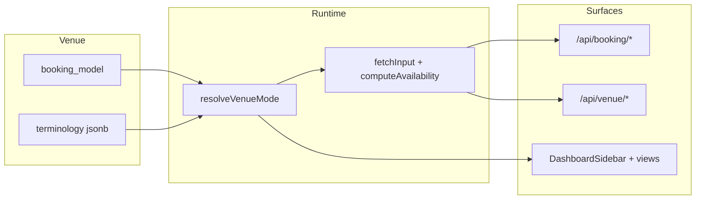

# Resneo - Bookable Services Landscape & Unified Architecture

**From Restaurant Bookings to Every Bookable Service in Northern Ireland**
**Originally March 2026** · **Last reviewed:** May 2026

This document is the **conceptual master reference** for Resneo's booking
models: what each scheduling pattern means, which business types map to it, and
the shared architecture that lets one codebase serve them all.

> **Status (May 2026):** All five booking models are **implemented and shipped**.
> The original version of this document was written while Models C–E (events,
> classes, resources) were still being built out and described them as work "to
> extend". That build-out is **complete** — see §1.3. The lasting value of this
> document is its **architecture and taxonomy** (the five-model framework, the
> business-type mapping, the feature matrix, the terminology system), all of
> which remain current. For up-to-date *functionality* status and the
> development roadmap, the authoritative sources are:
>
> - `Docs/Resneo-Appointments-Review-And-Roadmap.md` (Models A/B-appointments)
> - `Docs/Resneo-Class-Event-Resource-Functionality-Review-And-Plan-May-2026.md` (Models C/D/E)
> - `Docs/Resneo_Booking_Models_Reference.md` (canonical model definitions)

---

## 1. The Complete Landscape of Bookable Services

Every bookable business in Northern Ireland falls into one of five fundamental booking models. The critical insight - and the thing that will save you from building dozens of bespoke dashboards - is that while there are hundreds of specific business types, they all use one of a small number of scheduling patterns. If you build for the pattern, you cover every business in the category.

### 1.1 The Five Booking Models

**Model A: Table/Cover Reservation (MVP complete)**  
The guest books a time slot for a party at a venue. Capacity is measured in covers or tables. Duration is estimated by the venue. Multiple parties share the same time slot up to capacity.

Businesses: Restaurants, cafes, pubs, bars, gastropubs, hotel restaurants, afternoon tea venues, supper clubs.

**Model B: Practitioner Appointment (MVP shipped)**  
The client books a specific service with a specific practitioner for a defined duration. One client per practitioner at a time. The calendar is the practitioner’s day divided into bookable slots based on service durations, working hours, breaks, days off, and optional **staff calendar blocks** (blocked time on a given date).

Businesses: Barbers, hairdressers, beauty therapists, nail technicians, makeup artists, lash technicians, brow specialists, massage therapists, physiotherapists, osteopaths, chiropractors, podiatrists, occupational therapists, speech therapists, counsellors, psychotherapists, nutritionists, dietitians, acupuncturists, reflexologists, personal trainers, dog groomers, mobile mechanics, tutors, music teachers, driving instructors, photographers (session bookings), tattoo artists, piercing studios, opticians, dentists (private), private GPs, veterinary clinics, solicitors (consultations), accountants (consultations), financial advisers, mobile hairdressers, mobile beauticians, home cleaning services (scheduled), pet sitters.

**Model C: Event/Experience Ticket**  
The guest books a ticket to a specific event on a specific date and time. Capacity is a fixed number of tickets. Everyone starts at the same time. May have multiple ticket types (adult, child, VIP).

Businesses: Cooking classes, escape rooms, boat tours, whiskey tastings, wine tastings, pottery classes, art workshops, axe throwing, archery experiences, clay pigeon shooting, brewery tours, distillery tours, farm tours, ghost tours, walking tours, segway tours, outdoor adventures (kayaking, climbing, coasteering), theatre performances, comedy nights, live music venues, cinema screenings, kids party venues, team building events, food tours, foraging experiences, craft workshops, dance classes (drop-in), yoga retreats, wellness workshops.

**Model D: Class/Group Session**  
A recurring scheduled session with a fixed capacity. Clients book a spot in a specific instance of a recurring class. The same class repeats on a schedule (e.g. every Monday at 7pm).

Businesses: Yoga studios, pilates studios, spin/cycling studios, CrossFit boxes, martial arts schools, dance schools, swimming lessons, fitness bootcamps, gym classes, language classes, music schools (group lessons), kids activity clubs, baby/toddler classes (e.g. baby sensory, messy play), adult education workshops, sewing classes, cooking schools (recurring), book clubs, sports coaching groups.

**Model E: Resource/Facility Booking**  
The client books a physical space or resource for a defined time period. No specific staff member is required - it’s the resource that’s being reserved.

Businesses: Meeting rooms, co-working desks, sports pitches (5-a-side, tennis courts, padel courts), golf tee times, bowling lanes, hot tub hire, sauna rooms, photography studios, rehearsal rooms, recording studios, party rooms, function rooms, event spaces, caravan/glamping sites, holiday cottage changeover slots, equipment hire (bikes, paddleboards, kayaks), car wash bays, self-service dog wash, launderette machines.

### 1.2 Why Five Models Is Enough

You might look at this list and see 100+ business types. But every single one maps to one of five booking models. A barber and a physiotherapist use the exact same scheduling logic (practitioner appointment) - the only differences are the service names, the typical durations, and the industry-specific labels (a barber has "clients" and "cuts"; a physio has "patients" and "assessments"). Those are cosmetic differences handled by templates, not code.

This is the key architectural decision: **build five booking engines, not fifty dashboards.**

### 1.3 Implementation status (May 2026)

**All five models are shipped.** Summary; see the roadmap/review docs linked at
the top for detailed, current functionality status.

#### Model A (`table_reservation`)

**Status: shipped.** Service-based availability engine, deposits, communications, day sheet, table management (floor plan / table grid, automatic table combination, covers vs table mode), dining waitlist, reporting.

#### Model B (`practitioner_appointment` / `unified_scheduling`)

**Status: shipped, including reception-parity Phase 1a.** Beyond the core scheduling surfaces below, the following shipped in May 2026 (behind per-venue feature flags pending pilot rollout): **any-available practitioner**, **guest self-reschedule**, **appointment waitlist v2**, **calendar blocks UI**, and a unified booking detail surface. See `Docs/Resneo-Appointments-Review-And-Roadmap.md`.

Core implementation surfaces:

| Area | What exists (code pointers) |
|------|------------------------------|
| Team | `practitioners` via venue API; working hours, breaks, days off in dashboard - [`src/app/dashboard/availability/AppointmentAvailabilitySettings.tsx`](../src/app/dashboard/availability/AppointmentAvailabilitySettings.tsx) |
| Services | `appointment_services` + `practitioner_services`; `/dashboard/appointment-services` |
| Calendar | Practitioner calendar - [`src/app/dashboard/practitioner-calendar/PractitionerCalendarView.tsx`](../src/app/dashboard/practitioner-calendar/PractitionerCalendarView.tsx); registry-style view `/dashboard/calendar`; detail sheet (edit time, drag reschedule); [`src/app/api/venue/practitioner-calendar-blocks/`](../src/app/api/venue/practitioner-calendar-blocks/); calendar entitlement - [`src/app/api/venue/calendar-entitlement/route.ts`](../src/app/api/venue/calendar-entitlement/route.ts) |
| Availability | [`src/lib/availability/appointment-engine.ts`](../src/lib/availability/appointment-engine.ts) + `fetchAppointmentInput`; working-hours keys align with JS `getDay()` / [`getDayOfWeek`](../src/lib/availability/engine.ts) (0 = Sunday … 6 = Saturday) |
| Staff edits | [`PATCH` venue booking](../src/app/api/venue/bookings/[id]/route.ts): exclude current booking from overlap; `skipPastSlotFilter` for same-day time moves; existing bookings use per-link **custom duration** where set |
| Bookings | Appointments-oriented bookings UI; walk-in API for appointment venues; group booking support where enabled; `client_arrived_at` (arrived/waiting before “Seated”) |
| Payments / comms | Stripe Connect; templated email/SMS; deposit-request and comm log types - see migration [`supabase/migrations/20260402000000_deposit_request_email_and_comm_logs_types.sql`](../supabase/migrations/20260402000000_deposit_request_email_and_comm_logs_types.sql) |

**Tooling note:** Linting uses **Next.js ESLint** ([`eslint.config.mjs`](../eslint.config.mjs) - `eslint-config-next` core-web-vitals + TypeScript), plus a repo-local rule that warns on hand-rolled modal overlays. The **React Compiler** is enabled via `babel-plugin-react-compiler` (see `package.json`).

#### Models C, D, E (`event_ticket`, `class_session`, `resource_booking`)

**Status: shipped.** Models C/D/E reached parity with Model B on the things that matter for running a venue end-to-end — catalogue management, public booking, payments, cancellation, comms, roster/attendance, reporting, and unified calendar/list/dashboard surfaces.

- **Database:** Core tables and `bookings` FKs created in [`supabase/migrations/20260327000001_multi_model_foundation.sql`](../supabase/migrations/20260327000001_multi_model_foundation.sql); class commerce, recurring reservations and related tables added later (see `Docs/schema.sql`).
- **Availability:** Dedicated engines ([`src/lib/availability/event-ticket-engine.ts`](../src/lib/availability/event-ticket-engine.ts) and siblings) + `POST /api/booking/create` validation branches.
- **Dashboard:** Full managers — event manager, class timetable (+ class commerce products), resource timeline.

**Known maturity gaps (not "incomplete", but uneven vs appointments):** post-booking **guest self-modify** and **staff slot reschedule** for C/D/E are intentionally limited to view/cancel + cancel-and-rebook; resources lack an instance detail sheet and calendar drag. These are documented and code-enforced — see `Docs/Resneo-Class-Event-Resource-Functionality-Review-And-Plan-May-2026.md` for the full per-model review and remaining polish items.

---

## 2. What Each Model Needs - Feature Matrix

| Feature | A: Table | B: Appointment | C: Event | D: Class | E: Resource |
|---|---|---|---|---|---|
| Calendar type | Slot/sitting grid | Practitioner day calendar + registry calendar | Event listing by date | Recurring timetable | Resource timeline |
| Capacity unit | Covers/tables | 1 client per practitioner | Tickets per event | Spots per class | Time slots per resource |
| Duration set by | Venue (turn time) | Service duration (+ buffer) | Event duration (fixed) | Class duration (fixed) | Client (booking length) |
| Multiple staff | N/A (table-based) | Yes - each has own calendar | Optional (instructor) | Yes (instructor per class) | N/A (resource-based) |
| Service menu | N/A | Yes - `appointment_services` + links | Ticket types/tiers | Class types | Resource types |
| Recurring schedule | Opening hours | Practitioner working hours | One-off or repeating | Weekly timetable | `availability_hours` on resource |
| Deposit/payment | Deposit per cover | Full or deposit per service (Stripe) | Full payment upfront | Per-class or package | Full or slot-based |
| Client record | Guest record | Guest/client with history | Attendee list | Member/participant | Booker details |
| No-show handling | Deposit forfeit | Cancellation fee or forfeit | Usually non-refundable | Spot released | Slot released |
| Walk-ins | Yes (walk-in queue) | Yes - venue walk-in API for appointment venues | No (ticketed) | Yes (if spots remain) | No (must book) |
| Check-in | Day sheet / table status | `client_arrived_at` + status (e.g. Seated) | Attendee check-in | Class roster check-in | N/A |
| Staff unavailability | Table / floor blocks | Per-practitioner **calendar blocks** (not table blocks) | - | - | - |
| Key dashboard view | Day sheet + table grid | Practitioner calendar, calendar registry, services, availability | Event management (partial) | Timetable (partial) | Resource timeline (partial) |
| Reminders | SMS 24h before | SMS/email per settings | Email with ticket/details | Email day before | Email day before |
| Online payment | Deposit via Stripe | Full or deposit via Stripe | Full via Stripe | Per-class or membership | Full via Stripe |

### 2.1 Shared Infrastructure Across All Models

These features are identical regardless of booking model and are already built or shared:

- Authentication and user management (Supabase Auth)
- Stripe Connect for payments (direct charges to venue)
- Communication engine (SendGrid email + Twilio SMS) - [`src/lib/communications/`](../src/lib/communications/)
- Confirm-or-cancel flow
- Guest/client record with identity matching
- Events / audit logging
- Booking page and embed/widget (layout varies by `booking_model`)
- QR codes
- Reporting framework
- Onboarding wizard framework (shared shell; steps vary)

---

## 3. The Unified Architecture

### 3.1 The Template Approach

Instead of building separate applications for each business type, build a **template system** where the business type selection at onboarding configures:

1. **Which booking model** drives the availability engine (`venues.booking_model`)
2. **Which dashboard views** are shown in the sidebar
3. **Which terminology** is used throughout the UI (`venues.terminology` merged with defaults)
4. **Which default services/settings** are pre-populated
5. **Which booking page layout** guests see

Everything else - auth, payments, communications, reporting - is shared.

### 3.2 Cross-model implementation pattern (follow Model B)

Use this checklist when extending C, D, or E so they stay consistent with what Model B proved out.



| Layer | Rule |
|--------|------|
| **Venue** | `venues.booking_model` (enum), optional `business_type` / `business_category`, `terminology` JSONB. Resolved in [`src/lib/venue-mode.ts`](../src/lib/venue-mode.ts). |
| **Booking row** | Single `bookings` row per reservation; populate **one** model FK: Model A uses service/table semantics; Model B `practitioner_id` + `appointment_service_id`; Model C `experience_event_id`; Model D `class_instance_id`; Model E `resource_id` (+ `booking_end_time` where required). |
| **Availability** | Pair `fetch*Input(supabase, venueId, date, …)` with `compute*Availability(input)` under [`src/lib/availability/`](../src/lib/availability/). Mirror appointment-engine: pure compute + explicit fetcher. |
| **Public API** | Guest actions under [`src/app/api/booking/`](../src/app/api/booking/) (`create`, `availability`, etc.). |
| **Staff API** | CRUD and staff actions under [`src/app/api/venue/`](../src/app/api/venue/) namespaced by entity (`experience-events`, `classes`, `resources`, …). |
| **Staff reschedule** | When venue `PATCH` changes date/time, validate with the same engine, **excluding** the current booking id from capacity; add model-specific flags if “past slot” or equivalent matters (see Model B `skipPastSlotFilter`). |
| **Dashboard** | Add nav via `MODEL_NAV_ITEMS` and conditional labels in [`DashboardSidebar.tsx`](../src/app/dashboard/DashboardSidebar.tsx) - do not fork apps. |

### 3.3 Business type → model mapping

At onboarding, the business picks a type; the system sets `booking_model`, `business_type`, and default `terminology`. **The runtime source of truth is the database** (`venues` columns) plus code in `resolveVenueMode` and [`src/types/booking-models.ts`](../src/types/booking-models.ts).

The long pseudo-config below is **illustrative only** - not a copy-paste of production code:

```typescript
// Illustrative - real defaults may live in signup/onboarding + DB
const EXAMPLES: Record<string, { model: BookingModel; terms: VenueTerminology }> = {
  restaurant: { model: 'table_reservation', terms: { client: 'Guest', booking: 'Reservation', staff: 'Staff' } },
  barber: {
    model: 'practitioner_appointment',
    terms: { client: 'Client', booking: 'Appointment', staff: 'Barber' },
  },
  escape_room: { model: 'event_ticket', terms: { client: 'Guest', booking: 'Booking', staff: 'Host' } },
  yoga_studio: { model: 'class_session', terms: { client: 'Member', booking: 'Booking', staff: 'Instructor' } },
  meeting_room: { model: 'resource_booking', terms: { client: 'Booker', booking: 'Booking', staff: 'Manager' } },
  other: { model: 'practitioner_appointment', terms: { client: 'Client', booking: 'Booking', staff: 'Staff' } },
};
```

Extend mappings when adding business types: prefer **config + DB** over hard-coding in random components.

### 3.4 Dashboard views per model

Each booking model shows a different set of dashboard pages. All models have shipped dashboard surfaces; nav is driven by `booking_model` + `enabled_models`.

| Dashboard page | A: Table | B: Appointment | C: Event | D: Class | E: Resource |
|---|---|---|---|---|---|
| Bookings / appointments list | ✅ | ✅ | ✅ | ✅ | ✅ |
| New booking / appointment | ✅ | ✅ | ✅ | ✅ | ✅ |
| Day sheet | ✅ | ✅ (appointment-oriented day view) | - | - | - |
| Table grid / floor plan | ✅ (if enabled) | - | - | - | - |
| Practitioner calendar | - | ✅ | - | - | - |
| Calendar (registry) | - | ✅ `/dashboard/calendar` | - | - | - |
| Appointment services + team hours | - | ✅ Services + Availability | - | - | - |
| Event manager | - | - | ✅ | - | - |
| Class timetable (+ commerce products) | - | - | - | ✅ | - |
| Resource timeline | - | - | - | - | ✅ |
| Waitlist | ✅ (dining) | ✅ (appointment waitlist v2) | - | - | - |
| Reports / settings | ✅ (admin) | ✅ (admin) | ✅ (admin) | ✅ (admin) | ✅ (admin) |

Legend: ✅ shipped · - not applicable

### 3.5 Terminology system

Labels are **not** driven by a giant static `BUSINESS_TYPE_CONFIG` at runtime. Production behaviour:

- Defaults per model: [`DEFAULT_TERMINOLOGY` in `src/types/booking-models.ts`](../src/types/booking-models.ts)
- Per-venue overrides: `venues.terminology` JSONB merged in [`resolveVenueMode`](../src/lib/venue-mode.ts)
- UI helpers: [`src/lib/terminology.ts`](../src/lib/terminology.ts) where used

A physiotherapist can see Patient / Appointment / Physio; a barber sees Client / Appointment / Barber - via stored terminology, without forking components.

---

## 4. Build status and what comes next

### 4.1 All five models delivered

The original build sequence (A → B → C → D → E) is **complete**. Every model has
a shipped availability engine, public booking flow, staff management surface,
payment path, and presence on the unified calendar, bookings list, reports and
dashboard home.

| Model | Status | Notes |
|---|---|---|
| A: Table | Shipped | Table management, combination engine, covers/table modes, dining waitlist |
| B: Appointment | Shipped | Incl. Phase 1a reception parity (any-stylist, reschedule, waitlist v2, blocks) |
| C: Event | Shipped | Event manager, ticket tiers, attendee/roster tooling |
| D: Class | Shipped | Timetable, instances, roster, **class commerce** (credits/courses/memberships) |
| E: Resource | Shipped | Resource timeline, duration-based booking, pricing rules |

### 4.2 Where the work goes now

Development is no longer about *completing models* — it is about **closing the
operating loop and winning segments**. The current priorities live in the
roadmap docs, not here:

- **Appointments-family roadmap** — checkout/payment surface, compliance
  (consultation forms, patch tests), retention (packages, reviews, loyalty),
  growth channels, native staff app. See
  `Docs/Resneo-Appointments-Review-And-Roadmap.md`.
- **Classes / events / resources** — post-booking guest self-modify and staff
  reschedule parity, resource calendar ops, account-portal depth. See
  `Docs/Resneo-Class-Event-Resource-Functionality-Review-And-Plan-May-2026.md`.

---

## 5. Database schema strategy

**Canonical DDL lives in Supabase migrations** - do not treat this section as SQL to run manually. Key files:

| Migration | Contents |
|-----------|----------|
| [`20260327000001_multi_model_foundation.sql`](../supabase/migrations/20260327000001_multi_model_foundation.sql) | `booking_model` enum on `venues`; Model B–E core tables; nullable FKs on `bookings` |
| [`20260401000000_practitioner_calendar_blocks.sql`](../supabase/migrations/20260401000000_practitioner_calendar_blocks.sql) | `practitioner_calendar_blocks` |
| [`20260331000001_booking_client_arrived.sql`](../supabase/migrations/20260331000001_booking_client_arrived.sql) | `bookings.client_arrived_at` |
| [`20260330000001_group_booking_columns.sql`](../supabase/migrations/20260330000001_group_booking_columns.sql) | Group booking columns on `bookings` |
| [`20260402000000_deposit_request_email_and_comm_logs_types.sql`](../supabase/migrations/20260402000000_deposit_request_email_and_comm_logs_types.sql) | Comms / deposit-request related |

### 5.1 Shared tables

- **`venues`** - `booking_model`, `business_type`, `business_category`, `terminology` (and existing venue fields).
- **`bookings`** - Nullable FKs: `practitioner_id`, `appointment_service_id`, `experience_event_id`, `class_instance_id`, `resource_id` (only relevant columns populated per model). Additional columns: e.g. `booking_end_time`, `estimated_end_time`, `client_arrived_at`, group fields per migrations.
- **`guests`** - Universal client/guest identity.
- **Audit / comms** - e.g. `events` (booking audit trail), `communications`, `communication_logs` (see migrations for exact columns).

### 5.2 Model B - core tables (names as implemented)

- **`practitioners`** - `working_hours` JSONB (keys `"0"`–`"6"` for Sun–Sat, aligned with dashboard + `getDayOfWeek`), `break_times`, `days_off`, etc.
- **`appointment_services`** - venue service menu (duration, buffer, price, deposit, colour).
- **`practitioner_services`** - links practitioner ↔ service; optional `custom_duration_minutes`, `custom_price_pence`.
- **`practitioner_calendar_blocks`** - date-scoped blocked intervals per practitioner (see migration above).

### 5.3 Model C - core tables

- **`experience_events`** - not `venue_events`; stores dated experiences, capacity, recurrence fields, `parent_event_id`.
- **`event_ticket_types`** - `event_id` references **`experience_events.id`**.

Implementation status: tables + engine + `booking/create` branch - see §1.3.

### 5.4 Model D - core tables

- **`class_types`**, **`class_timetable`**, **`class_instances`** - as created in multi-model migration; `instructor_id` may reference `practitioners`.

Implementation status: see §1.3.

### 5.5 Model E - core tables

- **`venue_resources`** - availability JSONB, slot length, min/max booking, pricing.

Implementation status: see §1.3.

---

## 6. The onboarding experience per model

### 6.1 Shared steps (all models)

- Early steps: business identity (name, address, phone, photo - as implemented in signup/onboarding).
- Final steps: preview, go-live, Stripe Connect, QR/widget - as implemented.

### 6.2 Target model-specific steps (product vision)

**Model A (restaurants):** Opening hours → slot model and capacity → deposits → preview. **Largely as built.**

**Model B (appointments):** Your team (practitioners + working hours) → services (menu + who offers what) → deposits/payments → preview.

**Model C (events):** First event (date, time, capacity, ticket types) → payments → preview.

**Model D (classes):** Class types → weekly timetable → payments → preview.

**Model E (resources):** Resources + availability → pricing → preview.

### 6.3 Current vs target (Model B)

Today, appointment venues typically configure **team, services, and hours** through **Settings → Availability** (appointment team/hours), **Appointment services**, and related venue APIs - not necessarily a single linear wizard that matches every bullet in §6.2. When onboarding copy and dashboard settings diverge, treat **§6.2 as the target UX** and the dashboard routes as **source of truth for what works today**.

#### Model B wizard today (`practitioner_appointment`)

The linear flow in [`src/app/onboarding/page.tsx`](../src/app/onboarding/page.tsx) is **profile → team (practitioner names/emails) → services (basic menu: name, duration, price) → preview**. It does **not** yet cover every §6.2 bullet. Use this matrix to see what is in-wizard vs dashboard:

| §6.2 target | In onboarding wizard today | Configure after onboarding (dashboard) |
|-------------|---------------------------|----------------------------------------|
| Practitioners + **working hours** | Names (and optional emails) only; no `working_hours` payload | **Availability** - [`src/app/dashboard/availability/AppointmentAvailabilitySettings.tsx`](../src/app/dashboard/availability/AppointmentAvailabilitySettings.tsx) (`/dashboard/availability`) |
| Services + **who offers what** | Creates `appointment_services` only; no `practitioner_services` links | **Services** - [`src/app/dashboard/appointment-services/AppointmentServicesView.tsx`](../src/app/dashboard/appointment-services/AppointmentServicesView.tsx) (`/dashboard/appointment-services`) |
| **Deposits / payments** | No dedicated step | Stripe Connect and payment/deposit settings via **Settings** (`/dashboard/settings`) and service-level deposits on Appointment services |
| Preview / go-live | Yes | - |

The onboarding **preview** step surfaces short reminders and links to these routes so venues are not left assuming §6.2 is fully completed inside the wizard.

### 6.4 Smart defaults

When the user selects a business type, pre-populate sensible defaults (services, hours, terminology) from DB seeds or TS config so users edit rather than invent structure. Same principle applies to C/D/E once those flows are prioritised.

---

## 7. Maintaining simplicity - guidelines

### 7.1 Rules for what's configurable vs fixed

**Configurable by the business (through settings):**

- Business name, address, logo, description
- Services / events / classes / resources (names, durations, prices)
- Working hours and availability
- Practitioner profiles
- Deposit amounts and cancellation policy
- Communication template wording

**Configurable by business type (template / DB, not ad hoc code):**

- Which dashboard views are shown
- Terminology (Guest vs Client vs Patient)
- Default services and settings
- Booking page layout
- Which booking model drives availability

**NOT configurable (fixed product rules):**

- The five booking models (no arbitrary hybrids in MVP)
- Core schema (change via migrations)
- Payment rail (Stripe Connect direct charges)
- Communication channels (email + SMS through abstraction layer)
- Cancellation framework shape (windows configurable inside the framework)

### 7.2 The "Other" escape hatch

**Other** should default to **`practitioner_appointment`** with blank or minimal service templates - flexible for unknown service businesses.

### 7.3 One codebase, one dashboard shell

Single Next.js app: shared shell, conditional nav and pages by `booking_model`. New **business types** should be config/DB where possible; new **models** are rare and require engines + migrations.

---

## 8. Pricing model summary

> **Out of date — indicative only.** This predates the **Appointments Light /
> Plus** tiers. For current pricing see `Docs/PRD.md` §6 and
> `Docs/Resneo-Appointments-Review-And-Roadmap.md` §2.2.

| Model | Pricing | Rationale |
|---|---|---|
| A: Table Reservation | £79/month flat | Venue-based |
| B: Practitioner Appointment | £10/user/month (calendar/practitioner limits per plan) | Scales with team |
| C: Event/Experience | £79/month flat | Venue-based |
| D: Class/Group | £79/month flat | Studio-based |
| E: Resource/Facility | £79/month flat | Facility-based |

Solo practitioners get low entry; multi-practitioner businesses scale; venue-based models pay flat regardless of headcount (subject to actual billing implementation in Stripe/products).

---

## 9. Summary

All five booking models are built and shipped. This document's enduring purpose
is the **architecture and taxonomy**: the five-model framework, the business-type
mapping, the feature matrix, the unified-app pattern, and the terminology system.

What that means in practice:

1. **New business types** map to one of the five existing models and extend
   **terminology + defaults** — no new code or engines required.
2. **New engines / models** are rare and only justified by a genuinely new
   scheduling *pattern*, not by a new industry name.
3. **Current development priorities** are not "finish the models" — they are
   closing the operating loop and winning target segments. See the roadmap docs
   linked at the top of this document and in §4.2.

For pricing, see `Docs/PRD.md` and the appointments roadmap — the indicative
table in §8 predates the Appointments Light/Plus tiers and should not be treated
as current.
