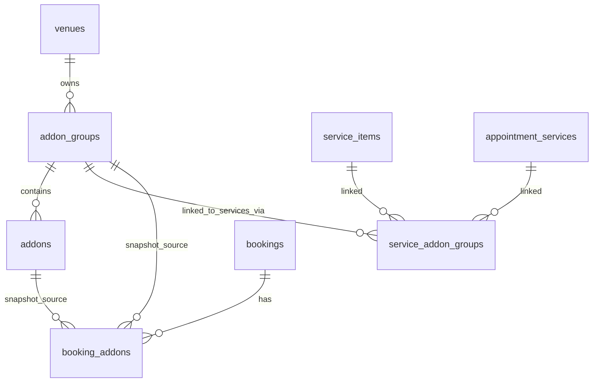

> **ARCHIVED (2026-07-04).** This work has shipped. Kept for historical and architecture reference only; it does not describe pending work. Any "not yet built" / "proposed" / "no code written" status noted below is obsolete. See `Docs/archive/README.md`.

# Resneo Add-Ons — End-to-End Implementation Plan

**Status:** Proposed (no code written yet)
**Date:** 2026-05-27
**Owner:** TBD
**Related plans / references:**
- `Docs/Resneo_Bookable_Services_Landscape_Plan.md`
- `Docs/Resneo_Unified_Booking_Functionality.md`
- `Docs/reserveni-linked-accounts-spec.md`
- Service variants migration: `supabase/migrations/20260730120000_service_variants.sql`
- Variant override library: `src/lib/appointments/service-variant.ts`

---

## 0. Reading guide

This is the full, granular plan for adding **Add-Ons** to Resneo end-to-end. It is structured so that an engineer can work top-to-bottom in order, ship in phases (see §17 Rollout), and never have to invent shape or naming on the fly. Every section either:

- Names the file or table that already exists, or
- Specifies the **new** file/table to create, with exact name and columns/props.

When a decision could go two ways, the plan picks one and notes the alternative in §18 Open Questions.

---

## 1. Goal & scope

### 1.1 What we are building

Allow venues to define **Add-Ons** — optional extras a client can stack on top of a service at the moment of booking. Each add-on contributes additional **price** and optionally additional **duration** to the booked appointment.

Add-Ons are organised into **Groups** (mirroring Fresha/Vagaro) so venues can express selection constraints:

- "Pick exactly one conditioner" — single-select group with `min=1, max=1`.
- "Pick any number of finishing touches" — multi-select with `min=0, max=null`.
- "Pick up to 2 enhancements" — multi-select with `min=0, max=2`.

Groups are independent entities linked to one or many services. They are owned at the **venue** level (with optional per-calendar/practitioner availability — see §13).

### 1.2 Use-cases supported on day one

- Hairdresser: "Olaplex treatment +£10 +15 min" added to a colour service.
- Restaurant (Appointments side, not table reservations): N/A — Add-Ons are an **Appointments-plan-only** feature for v1.
- Beauty salon: "French tips +£5 +0 min" on top of a manicure variant.
- Personal trainer: "Custom workout plan +£20 +0 min" on a coaching session.
- Spa: required choice between aromatherapy oils (single-select, `min=1`).
- Staff-only "skin patch test £15" — hidden from the public booking page but rendered on staff bookings, confirmations and receipts.

### 1.3 Out of scope (v1)

- Add-Ons on **Classes**, **Events**, or **Resources** (only `unified_scheduling` and legacy `appointments`).
- Add-Ons on **table reservations**.
- Per-add-on commission overrides (commission tracking is a separate, future feature).
- Add-On **inventory** (stock counts).
- Add-On **bundles** (an add-on that includes other add-ons).
- Quantity > 1 of the same add-on per booking (treat each add-on as a binary include/exclude).
- Converting an existing service into an add-on (Vagaro-style) — manual recreate for v1.

---

## 2. Codebase context (what already exists)

Before any new code, note these existing files. The plan slots into them rather than re-inventing infrastructure. **Read these first.**

### 2.1 Schema duality (critical)

Resneo has **two parallel appointment service tables**:

- **Unified scheduling venues** use `service_items` (created by `20260430120000_unified_scheduling_engine.sql`).
- **Legacy appointments venues** use `appointment_services` (created by `20260327000001_multi_model_foundation.sql`).

A helper in code switches between them. Search for `venueUsesUnifiedAppointmentServiceData()` (used in `src/app/api/venue/appointment-services/route.ts`). **Every new Add-On feature must work on both paths.** The simplest way: have add-on group links pointed at **both** parent FK columns (XOR-style), exactly as `service_variants` already does:

```sql
service_item_id UUID REFERENCES service_items(id),
appointment_service_id UUID REFERENCES appointment_services(id),
CHECK ((service_item_id IS NOT NULL) <> (appointment_service_id IS NOT NULL))
```

### 2.2 Existing tables and patterns to mirror

| Concern | File / Table | Why we mirror it |
|---|---|---|
| Service catalog | `service_items`, `appointment_services` | Parent of add-on group links |
| Variants | `service_variants` (migration `20260730120000_service_variants.sql`) | Same dual-FK + RLS pattern; same form UX pattern |
| Practitioner ↔ service link | `practitioner_services` | Same junction pattern with custom overrides |
| Calendar ↔ service link | `calendar_service_assignments` | Same junction for unified scheduling |
| Variant override library | `src/lib/appointments/service-variant.ts` (`applyVariantToService`, `applyVariantToAppointmentInput`, `resolveBookableServiceWithVariant`) | Same override-merge pattern for add-ons |
| Variant Zod schemas | `src/lib/venue/service-variants.ts` (`variantInputSchema`, `variantsArraySchema`) | Copy structure |
| Processing-time blocks | `src/lib/appointments/processing-time.ts` (`snapshotProcessingTimeBlocksFromCatalog`) | Reuse for snapshot logic |
| Bookings table | `bookings` | Add new FK + snapshot column; **and** add a child `booking_addons` table |
| Booking create routes | `src/app/api/booking/create/route.ts`, `create-multi-service/route.ts`, `create-group/route.ts` | All three must apply add-ons |
| Availability engine | `src/lib/availability/appointment-engine.ts` (`serviceSchedulingSpanMinutes`, `wallBusyIntervalsForServiceSlot`) | Total span must include add-on minutes |
| Availability API | `src/app/api/booking/availability/route.ts`, `validate-appointment-slot/route.ts`, `appointment-calendar/route.ts` | Accept `addon_ids` query param |
| Catalog API (public) | `src/app/api/booking/appointment-catalog/route.ts` | Include groups + add-ons in payload |
| Dashboard API | `src/app/api/venue/appointment-services/route.ts` | Returns add-on groups linked to a service in GET, accepts add-on group links in POST/PATCH |
| Dashboard UI | `src/app/dashboard/appointment-services/AppointmentServicesView.tsx`, `src/components/dashboard/appointment-services/AppointmentServiceFormFields.tsx` | Add a new "Add-Ons" section to the Add/Edit service form, mirroring the variant section |
| Public booking flow | `src/components/booking/AppointmentBookingFlow.tsx` | Add a new wizard step `'addons'` between `'variant'` and `'slot'` |
| Calendar / staff rendering | `src/app/dashboard/practitioner-calendar/PractitionerCalendarView.tsx`, `src/app/dashboard/bookings/BookingDetailPanel.tsx` | Show add-on chips and total |
| Booking detail summary API | `src/app/api/venue/bookings/[id]/summary/route.ts` | Hydrate `booking_addons` for staff UI |
| Comms enrichment | `src/lib/emails/booking-email-enrichment.ts` and templates under `src/lib/emails/templates/` | Templated add-on lines |
| Reports | `src/app/api/venue/reports/route.ts` (`buildAppointmentInsights`) | New "Add-on revenue" aggregation |
| Linked accounts | `Docs/reserveni-linked-accounts-spec.md`, RLS policy `linked_venue_can_view_appointment_services` | Add equivalent for `addon_groups` and `addons` |
| Tests | `src/lib/appointments/service-variant.test.ts`, `src/lib/availability/appointment-engine.test.ts`, `e2e/appointment-book-pay-confirm.spec.ts` | Add parallel test files |
| Migrations directory | `supabase/migrations/` (filename pattern `YYYYMMDDHHMMSS_description.sql`) | New migration named `<next-timestamp>_addons.sql` |
| Pricing / minor units | `price_pence`, `deposit_pence` are stored in pence (GBP minor units). Variants and add-ons use the same convention. | |
| Permissions | Variant management is **admin only** today. Add-Ons will follow the same rule. See `src/lib/venue-auth.ts` (`requireAdmin`). | |
| Feature flag pattern | `Docs/FEATURE_FLAGS.md` | New flag `addons_enabled` (per venue, default true on appointments plans; off on `appointments_light`) — see §17 |

### 2.3 Override merge order — extend, don’t replace

Today, the override chain for a booking is:

1. Practitioner / calendar custom overrides (`practitioner_services`, `calendar_service_assignments`).
2. Variant overrides (`service_variants`).
3. Staff duration overrides (staff booking UI popovers).

Add-Ons sit **on top** of the merged duration/price. They do not replace anything — they add. See §6 for the new helper `applyAddonsToResolvedService()`.

---

## 3. Data model (Supabase migrations)

New migration: `supabase/migrations/<next-timestamp>_addons.sql`.

> Use one migration to create all four tables + indexes + triggers. RLS policies go in a second statement block in the **same** migration file. Pattern is identical to `20260730120000_service_variants.sql`.

### 3.1 `addon_groups`

The container that expresses selection constraints. Linked to one or many services.

```sql
CREATE TABLE addon_groups (
  id UUID PRIMARY KEY DEFAULT gen_random_uuid(),
  venue_id UUID NOT NULL REFERENCES venues(id) ON DELETE CASCADE,

  name TEXT NOT NULL,                  -- internal label: "Conditioner choice"
  prompt_to_client TEXT,               -- shown above options at booking, optional
  description TEXT,                    -- longer staff-facing description

  selection_type TEXT NOT NULL
    CHECK (selection_type IN ('single', 'multi')),
  min_select INT NOT NULL DEFAULT 0
    CHECK (min_select >= 0),
  max_select INT
    CHECK (max_select IS NULL OR max_select >= min_select),
  -- For selection_type='single': max_select forced to 1 (enforced via CHECK below)
  CHECK (
    selection_type = 'multi'
    OR (selection_type = 'single' AND (max_select IS NULL OR max_select = 1))
  ),
  CHECK (
    selection_type = 'multi'
    OR (selection_type = 'single' AND min_select IN (0, 1))
  ),

  hidden_from_online BOOLEAN NOT NULL DEFAULT false,
  is_active BOOLEAN NOT NULL DEFAULT true,
  sort_order INT NOT NULL DEFAULT 0,

  created_at TIMESTAMPTZ NOT NULL DEFAULT now(),
  updated_at TIMESTAMPTZ NOT NULL DEFAULT now()
);

CREATE INDEX idx_addon_groups_venue
  ON addon_groups(venue_id)
  WHERE is_active = true;
```

Notes:

- `prompt_to_client` is the user-facing question, e.g. `"Choose your conditioner"`. Falls back to `name` when null.
- `min_select = 1, max_select = 1` on a `single` group makes the group **required**.
- `hidden_from_online` only suppresses the group in the public booking flow; staff bookings still see it; confirmations still render lines (see §11.4).

We do **not** include `applies_commission` or `applies_discounts` in v1 (commissions are out of scope). Leave room for them by keeping the table narrow — adding columns later is easy.

### 3.2 `addons`

The actual choices inside a group.

```sql
CREATE TABLE addons (
  id UUID PRIMARY KEY DEFAULT gen_random_uuid(),
  addon_group_id UUID NOT NULL REFERENCES addon_groups(id) ON DELETE CASCADE,
  venue_id UUID NOT NULL REFERENCES venues(id) ON DELETE CASCADE, -- denormalised for RLS/perf

  name TEXT NOT NULL,                  -- "Argan oil conditioner"
  description TEXT,

  additional_price_pence INT NOT NULL DEFAULT 0
    CHECK (additional_price_pence >= 0),
  additional_duration_minutes INT NOT NULL DEFAULT 0
    CHECK (additional_duration_minutes BETWEEN 0 AND 240),

  cost_to_business_pence INT
    CHECK (cost_to_business_pence IS NULL OR cost_to_business_pence >= 0),

  is_active BOOLEAN NOT NULL DEFAULT true,
  sort_order INT NOT NULL DEFAULT 0,

  archived_at TIMESTAMPTZ,             -- soft-delete (mirrors Fresha pattern)

  created_at TIMESTAMPTZ NOT NULL DEFAULT now(),
  updated_at TIMESTAMPTZ NOT NULL DEFAULT now()
);

CREATE INDEX idx_addons_group ON addons(addon_group_id);
CREATE INDEX idx_addons_venue_active ON addons(venue_id) WHERE is_active = true AND archived_at IS NULL;
```

Decisions:

- **Soft-delete via `archived_at`**, not hard-delete, so historical bookings can still resolve the name without snapshots being mandatory. We still snapshot (§3.4) for the price/duration fields.
- `additional_duration_minutes` capped at 240 to match the existing service duration upper bound (5–480, but for additive minutes a tighter cap reduces foot-guns).
- No `additional_buffer_minutes` in v1. The booking takes the buffer from the base service. (See §18.)
- `cost_to_business_pence` is informational only, used in reports later. Not surfaced to the client.

### 3.3 `service_addon_groups` — the link table

```sql
CREATE TABLE service_addon_groups (
  id UUID PRIMARY KEY DEFAULT gen_random_uuid(),
  venue_id UUID NOT NULL REFERENCES venues(id) ON DELETE CASCADE,

  service_item_id UUID REFERENCES service_items(id) ON DELETE CASCADE,
  appointment_service_id UUID REFERENCES appointment_services(id) ON DELETE CASCADE,
  CHECK ((service_item_id IS NOT NULL) <> (appointment_service_id IS NOT NULL)),

  addon_group_id UUID NOT NULL REFERENCES addon_groups(id) ON DELETE CASCADE,

  sort_order INT NOT NULL DEFAULT 0,

  created_at TIMESTAMPTZ NOT NULL DEFAULT now(),

  -- Each group can be linked to a given service only once
  UNIQUE (service_item_id, addon_group_id),
  UNIQUE (appointment_service_id, addon_group_id)
);

CREATE INDEX idx_service_addon_groups_service_item   ON service_addon_groups(service_item_id);
CREATE INDEX idx_service_addon_groups_appt_service   ON service_addon_groups(appointment_service_id);
CREATE INDEX idx_service_addon_groups_addon_group    ON service_addon_groups(addon_group_id);
CREATE INDEX idx_service_addon_groups_venue          ON service_addon_groups(venue_id);
```

`sort_order` controls the order groups appear in the booking flow for a given service.

### 3.4 `booking_addons` — snapshot of what was actually booked

Designed for immutability. Each row is one add-on chosen on one booking. Snapshot the price and duration **at booking time** so later catalog edits do not retroactively change the booking.

```sql
CREATE TABLE booking_addons (
  id UUID PRIMARY KEY DEFAULT gen_random_uuid(),
  booking_id UUID NOT NULL REFERENCES bookings(id) ON DELETE CASCADE,

  -- FK references kept for joins, but with SET NULL semantics — snapshot fields are the source of truth
  addon_id UUID REFERENCES addons(id) ON DELETE SET NULL,
  addon_group_id UUID REFERENCES addon_groups(id) ON DELETE SET NULL,

  -- Multi-service / multi-segment bookings: which segment does this add-on belong to?
  -- Null for single-service bookings.
  booking_segment_index INT,

  -- Snapshot fields (immutable once set)
  addon_name_snapshot TEXT NOT NULL,
  addon_group_name_snapshot TEXT,
  price_pence_at_booking INT NOT NULL CHECK (price_pence_at_booking >= 0),
  duration_minutes_at_booking INT NOT NULL DEFAULT 0
    CHECK (duration_minutes_at_booking BETWEEN 0 AND 240),
  cost_to_business_pence_at_booking INT,

  created_at TIMESTAMPTZ NOT NULL DEFAULT now()
);

CREATE INDEX idx_booking_addons_booking ON booking_addons(booking_id);
CREATE INDEX idx_booking_addons_addon   ON booking_addons(addon_id);
CREATE INDEX idx_booking_addons_group   ON booking_addons(addon_group_id);
```

Snapshot rationale (mirrors Fresha and `service_variants`):

> Changes to individual service prices won't affect already-booked bundles — same applies to add-ons.

If an admin edits an add-on price next week, every `booking_addons` row keeps its `price_pence_at_booking`. New bookings will use the new price.

### 3.5 New booking columns (aggregates)

Add to `bookings` (single migration statement):

```sql
ALTER TABLE bookings
  ADD COLUMN addons_total_price_pence INT NOT NULL DEFAULT 0,
  ADD COLUMN addons_total_duration_minutes INT NOT NULL DEFAULT 0;
```

These are denormalised totals — sum of all `booking_addons` rows for the booking. They make the calendar grid and reports cheap (no per-render `SUM()`).

**Maintenance:** The booking-create routes set these values **once** during insert. We do not write a trigger to keep them in sync — the snapshot rule says they are frozen at booking time.

A staff "modify booking" flow (`src/app/api/venue/bookings/[id]/modify/route.ts` and similar) can recompute and overwrite both columns + replace `booking_addons` rows in a single transaction.

### 3.6 `updated_at` triggers

Replicate the pattern from `20260730120000_service_variants.sql`:

```sql
CREATE TRIGGER trg_addon_groups_updated_at
  BEFORE UPDATE ON addon_groups
  FOR EACH ROW EXECUTE FUNCTION set_updated_at();

CREATE TRIGGER trg_addons_updated_at
  BEFORE UPDATE ON addons
  FOR EACH ROW EXECUTE FUNCTION set_updated_at();
```

(`set_updated_at()` already exists from earlier migrations.)

### 3.7 RLS policies

Pattern matches `service_variants` and `practitioner_services`. All four tables get RLS enabled.

```sql
ALTER TABLE addon_groups          ENABLE ROW LEVEL SECURITY;
ALTER TABLE addons                ENABLE ROW LEVEL SECURITY;
ALTER TABLE service_addon_groups  ENABLE ROW LEVEL SECURITY;
ALTER TABLE booking_addons        ENABLE ROW LEVEL SECURITY;
```

#### Service-role (server APIs)

Each table gets a `service_role` ALL policy. Copy-paste from `service_variants` migration — the same `(SELECT auth.role()) = 'service_role'` predicate.

#### Staff (dashboard JWT)

Three tables (`addon_groups`, `addons`, `service_addon_groups`) get a `staff_manage_*` ALL policy:

```sql
CREATE POLICY staff_manage_addon_groups ON addon_groups
  FOR ALL USING (
    EXISTS (
      SELECT 1 FROM staff s
      WHERE s.venue_id = addon_groups.venue_id
        AND s.email = (auth.jwt() ->> 'email')
    )
  );
```

(Same predicate as `staff_manage_service_variants`. Replicate for `addons` and `service_addon_groups`.)

For `booking_addons`, the policy joins through `bookings.venue_id`:

```sql
CREATE POLICY staff_read_booking_addons ON booking_addons
  FOR SELECT USING (
    EXISTS (
      SELECT 1 FROM bookings b
      JOIN staff s ON s.venue_id = b.venue_id
      WHERE b.id = booking_addons.booking_id
        AND s.email = (auth.jwt() ->> 'email')
    )
  );
```

We do **not** grant staff INSERT/UPDATE/DELETE on `booking_addons` — the server-side booking create/modify route writes via service role. Staff dashboard reads via SELECT.

#### Public (anon)

Public read for booking page rendering — only **active**, **not archived**, **not hidden** entities.

```sql
CREATE POLICY public_read_addon_groups ON addon_groups
  FOR SELECT USING (
    is_active = true
    AND hidden_from_online = false
  );

CREATE POLICY public_read_addons ON addons
  FOR SELECT USING (
    is_active = true
    AND archived_at IS NULL
    AND EXISTS (
      SELECT 1 FROM addon_groups g
      WHERE g.id = addons.addon_group_id
        AND g.is_active = true
        AND g.hidden_from_online = false
    )
  );

CREATE POLICY public_read_service_addon_groups ON service_addon_groups
  FOR SELECT USING (
    EXISTS (
      SELECT 1 FROM addon_groups g
      WHERE g.id = service_addon_groups.addon_group_id
        AND g.is_active = true
        AND g.hidden_from_online = false
    )
  );
```

#### Linked accounts

Mirror `linked_venue_can_view_appointment_services` (from `20260919120000_linked_accounts.sql`). For each of `addon_groups`, `addons`, `service_addon_groups`, add a SELECT-only policy when the venue is linked with `full_details` grant. Use the same join through `account_links` / `linked_account_grants`.

(See `Docs/reserveni-linked-accounts-spec.md` §"Read scopes" for the exact predicate.)

### 3.8 Backfill / default state

No backfill: the new tables start empty. Existing services continue to work with no add-ons. The booking columns default to 0.

---

## 4. TypeScript types

Add to `src/types/booking-models.ts` (where `AppointmentService` and `ServiceVariant` live):

```typescript
export interface AddonGroup {
  id: string;
  venue_id: string;
  name: string;
  prompt_to_client: string | null;
  description: string | null;
  selection_type: 'single' | 'multi';
  min_select: number;
  max_select: number | null;
  hidden_from_online: boolean;
  is_active: boolean;
  sort_order: number;
  created_at: string;
  updated_at: string;
}

export interface Addon {
  id: string;
  addon_group_id: string;
  venue_id: string;
  name: string;
  description: string | null;
  additional_price_pence: number;
  additional_duration_minutes: number;
  cost_to_business_pence: number | null;
  is_active: boolean;
  sort_order: number;
  archived_at: string | null;
  created_at: string;
  updated_at: string;
}

export interface ServiceAddonGroupLink {
  id: string;
  venue_id: string;
  service_item_id: string | null;
  appointment_service_id: string | null;
  addon_group_id: string;
  sort_order: number;
}

export interface BookingAddonRecord {
  id: string;
  booking_id: string;
  addon_id: string | null;
  addon_group_id: string | null;
  booking_segment_index: number | null;
  addon_name_snapshot: string;
  addon_group_name_snapshot: string | null;
  price_pence_at_booking: number;
  duration_minutes_at_booking: number;
  cost_to_business_pence_at_booking: number | null;
}

/** Group with its options + the group's link to the service (for sort_order). */
export interface AppointmentCatalogAddonGroup {
  group: AddonGroup;
  addons: Addon[];        // active only, ordered by sort_order
  link_sort_order: number;
}

/** A single chosen add-on from the booking flow, used in API requests. */
export interface BookingAddonSelectionInput {
  addon_id: string;
  /** Optional: which segment of a multi-service booking this belongs to. */
  booking_segment_index?: number;
}
```

Extend `AppointmentService` and `ServiceItem` types to optionally include `addon_groups?: AppointmentCatalogAddonGroup[]` (parallel to the existing `variants?: ServiceVariant[]`).

Extend the booking shape (anywhere `Booking` is consumed in the UI) to optionally include `addons?: BookingAddonRecord[]` plus aggregate `addons_total_price_pence` and `addons_total_duration_minutes`.

---

## 5. Backend library — `src/lib/addons/`

Create a new module:

```
src/lib/addons/
  addon-resolution.ts          // load + filter active groups/addons for a service
  addon-selection-validation.ts // enforce min/max/selection_type at API boundary
  apply-addons-to-service.ts   // override-chain helper, parallel to applyVariantToService
  snapshot-addons.ts           // turn validated selections into booking_addons rows
  zod-schemas.ts               // shared zod input shapes
  index.ts
```

### 5.1 `apply-addons-to-service.ts`

Lives next to `src/lib/appointments/service-variant.ts`. Same shape.

```typescript
// after merge + variant
export interface ResolvedServiceWithAddons extends ResolvedBookableService {
  selected_addons: Addon[];
  total_addon_price_pence: number;
  total_addon_duration_minutes: number;
}

export function applyAddonsToResolvedService(
  resolved: ResolvedBookableService,
  selected: Addon[],
): ResolvedServiceWithAddons {
  const addPrice = selected.reduce((sum, a) => sum + a.additional_price_pence, 0);
  const addDuration = selected.reduce((sum, a) => sum + a.additional_duration_minutes, 0);
  return {
    ...resolved,
    duration_minutes: resolved.duration_minutes + addDuration,
    price_pence: (resolved.price_pence ?? 0) + addPrice,
    selected_addons: selected,
    total_addon_price_pence: addPrice,
    total_addon_duration_minutes: addDuration,
  };
}
```

Critically, **`buffer_minutes` is not changed**. Add-ons add to billable/working duration, not buffer. (See §18.)

`deposit_pence` policy when add-ons are present:

- For `payment_requirement = 'deposit'`, the deposit stays at the **service+variant** deposit. Add-ons are not deposit-eligible in v1 (charged on the day or recovered at checkout). This avoids ballooning deposits unexpectedly and matches Fresha's default.
- For `payment_requirement = 'full_payment'`, the full charge **includes** add-ons (i.e. variant price + sum of add-on prices). This is the only safe option for "pay in full now".

These rules are codified in `resolveAppointmentServiceOnlineCharge()` (extend, do not replace) in `src/lib/appointments/appointment-service-payment.ts`.

### 5.2 `addon-selection-validation.ts`

```typescript
export interface AddonGroupForValidation {
  group: AddonGroup;
  active_addon_ids: string[];      // the addons currently selectable for this group
}

export interface ValidateSelectionResult {
  ok: boolean;
  errors: string[];                // human-readable
  resolvedAddons: Addon[];         // in canonical order
}

export function validateAddonSelections(
  selections: BookingAddonSelectionInput[],
  groupsForService: AddonGroupForValidation[],
  addonsById: Map<string, Addon>,
): ValidateSelectionResult {
  // - Reject IDs not in any group linked to the service.
  // - Group by addon_group_id; ensure selection_type/min/max obeyed.
  // - For single-select, ensure at most one selection per group.
  // - Return canonical list ordered by (group.sort_order, addon.sort_order).
}
```

This is called by the booking create routes **and** by the public availability route (so the engine knows the total duration for slot fitting).

### 5.3 `snapshot-addons.ts`

```typescript
export interface BookingAddonSnapshot {
  addon_id: string;
  addon_group_id: string;
  booking_segment_index: number | null;
  addon_name_snapshot: string;
  addon_group_name_snapshot: string | null;
  price_pence_at_booking: number;
  duration_minutes_at_booking: number;
  cost_to_business_pence_at_booking: number | null;
}

export function buildAddonSnapshots(
  selected: Addon[],
  groupsById: Map<string, AddonGroup>,
  segmentIndex: number | null = null,
): BookingAddonSnapshot[] { ... }
```

Used in the booking create route to bulk-insert into `booking_addons`.

### 5.4 `addon-resolution.ts`

```typescript
export async function loadAddonGroupsForService(
  db: SupabaseClient,
  params: {
    venueId: string;
    serviceId: string;
    serviceTable: 'service_items' | 'appointment_services';
    includeHidden?: boolean;        // staff bookings: true; public: false
    includeInactive?: boolean;      // staff editing: true; public/booking: false
  }
): Promise<AppointmentCatalogAddonGroup[]> { ... }
```

Returned shape matches the public catalog shape (§7.2). Hidden/inactive flags are applied here so callers don't need to re-filter.

### 5.5 `zod-schemas.ts`

```typescript
export const addonGroupInputSchema = z.object({
  id: z.string().uuid().optional(),               // when updating
  name: z.string().min(1).max(120),
  prompt_to_client: z.string().max(240).nullable().optional(),
  description: z.string().max(2000).nullable().optional(),
  selection_type: z.enum(['single', 'multi']),
  min_select: z.number().int().min(0).default(0),
  max_select: z.number().int().min(0).nullable().optional(),
  hidden_from_online: z.boolean().default(false),
  is_active: z.boolean().default(true),
  sort_order: z.number().int().nonnegative().default(0),
  addons: z.array(addonInputSchema).min(1, 'At least one option is required'),
}).superRefine((data, ctx) => {
  if (data.selection_type === 'single' && data.max_select && data.max_select > 1) {
    ctx.addIssue({ code: z.ZodIssueCode.custom, message: 'single-select groups must have max_select <= 1' });
  }
  if (data.max_select !== null && data.max_select !== undefined && data.max_select < data.min_select) {
    ctx.addIssue({ code: z.ZodIssueCode.custom, message: 'max_select must be >= min_select' });
  }
});

export const addonInputSchema = z.object({
  id: z.string().uuid().optional(),
  name: z.string().min(1).max(120),
  description: z.string().max(2000).nullable().optional(),
  additional_price_pence: z.number().int().nonnegative(),
  additional_duration_minutes: z.number().int().min(0).max(240),
  cost_to_business_pence: z.number().int().nonnegative().nullable().optional(),
  is_active: z.boolean().default(true),
  sort_order: z.number().int().nonnegative().default(0),
});

export const bookingAddonSelectionSchema = z.object({
  addon_id: z.string().uuid(),
  booking_segment_index: z.number().int().nonnegative().optional(),
});
```

---

## 6. Scheduling / availability engine integration

### 6.1 Total duration

The engine already computes the total slot span via `serviceSchedulingSpanMinutes` in `src/lib/availability/appointment-engine.ts`:

```typescript
return svc.duration_minutes + svc.buffer_minutes + legacyProcessingTail;
```

After `applyAddonsToResolvedService`, the `duration_minutes` on the resolved service **already includes** add-on minutes. So the engine call does not need to change as long as the caller passes the **post-add-on** resolved service. The whole point of the override chain is to keep the engine simple.

Audit list of all callers that need to apply add-ons **before** calling the engine:

| Caller | File | Status |
|---|---|---|
| Public availability | `src/app/api/booking/availability/route.ts` (`computeForPractitioner`) | **Must extend** — accept `addon_ids` query param |
| Validate-slot | `src/app/api/booking/validate-appointment-slot/route.ts` | **Must extend** — accept `addon_ids` in body |
| Appointment calendar (month grid) | `src/app/api/booking/appointment-calendar/route.ts` | **Must extend** — accept `addon_ids` query param |
| Create booking | `src/app/api/booking/create/route.ts` | Must extend — validate + apply + snapshot |
| Create multi-service | `src/app/api/booking/create-multi-service/route.ts` | Must extend — per-segment addons |
| Create group | `src/app/api/booking/create-group/route.ts` | Must extend — per-attendee addons |
| Staff modify booking | `src/app/api/venue/bookings/[id]/modify/route.ts` (if it exists; otherwise wherever staff modify lives) | Must extend |
| Client-side preview | `src/components/booking/AppointmentBookingFlow.tsx` (`effectiveOfferForBooking`) | Must extend |

### 6.2 `addon_ids` URL convention

For all GET endpoints, send a repeated query param: `?addon_ids=uuid1&addon_ids=uuid2`. The route parses to `string[]`. Empty == no add-ons.

For POSTs, send as JSON: `"addons": [{ "addon_id": "..." }]` (or `"selected_addons"` — see §7.4).

### 6.3 Engine fixtures

Update `src/lib/availability/appointment-engine.test.ts` to include a fixture where the service has add-ons attached. Cases:

- No add-ons selected → slot fits same as base.
- 30-min base + 15-min add-on → slot must accommodate 45 min.
- Selecting an inactive add-on → ignored.
- Hidden-from-online add-on selected via staff path → applied; via public path → rejected.

---

## 7. APIs

### 7.1 Dashboard CRUD — new namespace

Create `src/app/api/venue/addon-groups/` and `src/app/api/venue/addons/`. Match the conventions of `src/app/api/venue/appointment-services/route.ts`.

#### `GET /api/venue/addon-groups`

```
Query:
  ?include_inactive=true     (default false)
  ?owner_venue_id=<uuid>     (linked accounts — same pattern as appointment-services)

Response:
{
  groups: AddonGroup[],
  addons_by_group: Record<groupId, Addon[]>,
  service_links: ServiceAddonGroupLink[]
}
```

- Admin only (`requireAdmin(staff)`).
- Linked-account read-only when `owner_venue_id` is provided.

#### `POST /api/venue/addon-groups`

```
Body:
{
  ...addonGroupInputSchema,            // including embedded `addons: [...]`
  service_links?: {                    // optional: assign to services immediately
    service_item_ids?: string[],
    appointment_service_ids?: string[]
  }
}
Response: { group: AddonGroup, addons: Addon[], links: ServiceAddonGroupLink[] }
```

#### `PATCH /api/venue/addon-groups/[id]`

Same body shape. Embedded `addons` is **delete + reinsert** when present, mirroring the variant pattern. This means add-on IDs **change** on save. To make snapshots resilient to this, the `booking_addons` table never relies on the live add-on ID being stable (it has its own snapshot fields).

> **Alternative:** keep IDs stable by reconciling create/update/delete. This is cleaner but adds complexity. v1 picks delete+reinsert for simplicity and uses snapshots to compensate.

#### `DELETE /api/venue/addon-groups/[id]`

- Soft-deactivate (`is_active = false`) by default.
- Hard-delete only when there are zero `booking_addons` referencing any add-on in the group. The route returns `409 Conflict` with a clear error otherwise; client UI shows "Archive instead" CTA.

#### `POST /api/venue/addons` and `PATCH /api/venue/addons/[id]`

Manage individual add-ons in isolation (when admin opens an existing group and adds an option). Same Zod schema, scoped to a group via `addon_group_id`.

#### Service ↔ group link management

Add to the existing service routes — do **not** invent a new endpoint:

- `POST /api/venue/appointment-services` (create) accepts:
  ```json
  {
    "addon_group_links": [
      { "addon_group_id": "...", "sort_order": 0 }
    ]
  }
  ```
- `PATCH /api/venue/appointment-services/[id]` accepts the same field; on PATCH it **replaces** the full set of links (delete + reinsert), matching the variant convention. If the field is absent, links are untouched.

This means the "Add/Edit Service" form has a single round-trip to save everything, exactly like variants today.

### 7.2 Public booking API — extend existing routes

Do not create new public endpoints. Extend the three that the booking flow already calls.

#### `GET /api/booking/appointment-catalog`

Response gains:

```typescript
{
  services: Array<AppointmentService & {
    variants: ServiceVariant[];
    addon_groups: AppointmentCatalogAddonGroup[];   // NEW
  }>;
  practitioners: [...];
}
```

`AppointmentCatalogAddonGroup` only includes active + non-archived add-ons. `hidden_from_online = true` groups are **omitted** from the public catalog entirely. (Staff use a different endpoint — see §7.3.)

Each `AppointmentCatalogAddonGroup.group.prompt_to_client` is the question shown to the booker. Each `addons[]` entry includes name, description, additional price, additional duration.

#### `GET /api/booking/availability`

Accepts:

```
?addon_ids=uuid1&addon_ids=uuid2
```

The route validates these against the requested service's linked groups (via `addon-selection-validation.ts`) and then computes availability with the new (longer) duration.

If the selection is invalid (e.g. unknown add-on, violates min/max), the route returns `400` with `{ error: 'INVALID_ADDON_SELECTION', ... }`. The client should never produce an invalid request because the flow gates it — but the server enforces.

#### `POST /api/booking/validate-appointment-slot`

Body gains `addons?: BookingAddonSelectionInput[]`. Same validation flow.

#### `POST /api/booking/create`, `create-multi-service`, `create-group`

Body gains `addons?: BookingAddonSelectionInput[]` (for `create-group` it can be per-attendee — see below).

Algorithm in `create`:

1. Resolve service + variant (existing).
2. Load groups linked to the service.
3. Run `validateAddonSelections(...)`.
4. Apply add-ons to resolved service.
5. Compute total duration / price / deposit.
6. Insert booking row with `addons_total_price_pence` and `addons_total_duration_minutes` set.
7. Bulk-insert `booking_addons` rows from `buildAddonSnapshots(...)` within the same DB transaction.
8. Existing snapshot of `processing_time_blocks` is unchanged (add-ons don't currently affect processing blocks).

For `create-multi-service`, accept `addons` **per segment**:

```json
{
  "segments": [
    { "service_id": "...", "variant_id": "...", "addons": [...] },
    { "service_id": "...", "addons": [] }
  ]
}
```

Snapshots include `booking_segment_index`.

For `create-group`, accept `addons` **per attendee**, since each attendee may pick different add-ons. (`booking_segment_index` re-purposed as attendee index here, or add a new column — see §18.)

### 7.3 Staff "create booking" surface

The staff booking modal (e.g. `src/components/booking/StaffSurfaceBookingStack.tsx`) needs a parallel **staff-only** endpoint or query mode that exposes **all** active groups (including `hidden_from_online`). Two options:

- **Option A (preferred):** add `?include_hidden=true` to `GET /api/booking/appointment-catalog` and only honour it when the request is from an authenticated staff session.
- **Option B:** new `/api/venue/booking/appointment-catalog` route. More code, but cleaner separation. Pick A in v1.

The booking create routes already accept hidden add-on IDs as long as they exist and are linked to the service — no special staff check needed at the create boundary (the catalog is what hides them from the public).

### 7.4 Request field name

Use **`addons`** as the body field, not `selected_addons` or `addon_ids`. Each entry is an object `{ addon_id, booking_segment_index? }` so future per-add-on fields (e.g. quantity) can be added without breaking the API.

---

## 8. Dashboard UI — Add/Edit Service form

This is the most user-visible piece. We extend the existing form rather than adding a separate page.

### 8.1 Existing form anatomy

`src/components/dashboard/appointment-services/AppointmentServiceFormFields.tsx` already contains stacked sections:

1. Basic (name, description, colour).
2. Pricing & duration.
3. Variants (radio: "One fixed offering" vs "Multiple options" — inline array editor).
4. Processing time blocks.
5. Custom availability.
6. Staff customization toggles.
7. Payment requirement.

We insert a new **Section 4: Add-Ons** between the existing variants section and processing time blocks.

### 8.2 The "Add-Ons" section in the service form

UX (mocked in plain text):

```
─────────────────────────────────────────
ADD-ONS
Optional extras a client can add to this service at booking.
[ + Add an add-on group ▾ ]   <— dropdown: "Create new group" OR "Use existing group"

(If no groups attached yet, show empty-state CTA "Add an add-on group" with a brief explainer.)

─────────────────────────────────────────
For each attached group, render a card:

  ┌─────────────────────────────────────┐
  │ ☰  Conditioner choice                │  drag handle, group name, edit icon
  │    Pick exactly one · 2 options       │  selection_type summary line
  │    [ Edit ] [ Unlink from service ]   │
  │                                       │
  │    Argan oil conditioner +£5 +0min    │  read-only list of options
  │    Coconut oil conditioner +£3 +0min  │
  └─────────────────────────────────────┘
```

- **Drag handle** reorders groups for this service (writes back to `service_addon_groups.sort_order`).
- **Edit** opens an inline modal/drawer to edit the group itself (name, prompt, selection rules) and its options. Changes save to `addon_groups` and `addons` — affecting **all** services using this group. The modal must show a warning: "This group is also used by: [Service B, Service C]."
- **Unlink from service** removes the `service_addon_groups` row only (group + options remain in the venue's library).

### 8.3 "Create new group" inline modal

Fields (matching `addonGroupInputSchema`):

- **Group name** (internal label).
- **Prompt to client** (the question shown above options). Optional.
- **Selection type** — radio: "Pick one" / "Pick multiple".
- If "Pick one": checkbox "Required" → maps to `min_select = 1`.
- If "Pick multiple": numeric "Minimum to pick" (default 0), "Maximum to pick" (blank = no limit).
- **Hide from online booking** — checkbox.
- **Add-on options table** — inline array editor (mirror variants UX):
  - Name, price, additional minutes, optional description.
  - Drag to reorder.
  - "Mark inactive" toggle.

On save, POST `/api/venue/addon-groups` with `service_links: { service_item_ids: [<this-service-id>] }` (or `appointment_service_ids`), and the form refetches the service's `addon_group_links`.

### 8.4 "Use existing group" picker

A small searchable list of all add-on groups in the venue's library (admin sees inactive ones too). Selecting one writes a new `service_addon_groups` row.

### 8.5 Form-state model

In `src/components/dashboard/appointment-services/appointment-service-form-values.ts`, add:

```typescript
export interface AppointmentServiceAddonLinkFormRow {
  /** stable on the form, persisted as service_addon_groups.id */
  link_id?: string;
  addon_group_id: string;
  sort_order: number;
  /** Embedded for rendering only — not POSTed. */
  group_preview: AddonGroup & { addons: Addon[] };
}
```

Wire into form state next to `variants`.

### 8.6 Standalone "Add-ons library" page (admin only)

For venues that want to manage add-ons outside of a service edit, add a new dashboard page:

- Path: `src/app/dashboard/addons/page.tsx` + `AddonsLibraryView.tsx`.
- Sidebar entry under **Catalog → Add-Ons** (admin only). The sidebar nav file is `src/app/dashboard/DashboardSidebar.tsx`.
- The page shows a grouped list:
  - Top-level: groups (with badges showing selection type, active/inactive, hidden from online).
  - Expandable: the add-ons in each group.
  - Each group has a "Used by" column listing linked services. Clicking jumps to the service edit form.

This is the same place a venue would go to **convert a service to an add-on** in future (out of scope v1).

### 8.7 Settings & permissions

- **Admin only**, same as variants.
- A new feature flag `addons_enabled` (default true on Plus/Pro/Appointments-Pro plans, **off** on Appointments-Light). See §17.
- If the flag is off, the section in the service form does not render and the sidebar entry is hidden.

---

## 9. Public booking flow UI

`src/components/booking/AppointmentBookingFlow.tsx` is the wizard. We add a new step.

### 9.1 New step `'addons'`

Step order (single booking):

```
'service' → 'variant' → 'addons' → 'practitioner' → 'slot' → 'details' → 'payment' → 'confirmation'
```

If the chosen service+variant has **no** linked add-on groups (or all are hidden from online), the step is **skipped** automatically (`go(nextStep)`).

If at least one group exists, render one screen per group? Or all groups on one screen? Pick **all groups on one screen**, scrollable, with a fixed footer showing "Total: £X (Y min)". This minimises the number of clicks the booker must do — Fresha and Vagaro both do this.

### 9.2 Group UI

- `selection_type = 'single'` with `min_select = 1` → **radio buttons**, required to choose.
- `selection_type = 'single'` with `min_select = 0` → **radio buttons**, with an "(none)" pseudo-option that maps to no selection.
- `selection_type = 'multi'` → **checkboxes**; show "Pick up to N" or "Pick at least N" hint when applicable.
- Each option shows: name, optional description, **+£X**, **+Y min** if `additional_duration_minutes > 0`. If duration is 0, hide the duration chip.

### 9.3 Step header and prompt

- Header: "Add extras to your booking" (translatable string).
- Per-group header: `group.prompt_to_client ?? group.name`.

### 9.4 Live price/duration summary

Show a sticky footer or summary panel:

- "Total: £55.00 (90 min)" — recomputed live as the user toggles options.
- Use the existing `effectiveOfferForBooking` memo, extended to include `selected_addons`.

### 9.5 Validation

Client-side: enforce min/max before allowing "Continue". Disable "Continue" with a helper message like "Please choose at least 1 from Conditioner choice." Server-side enforcement still required (§7.2).

### 9.6 Persistence across steps

Selections live in the wizard local state. When the user goes back and changes the **service** or **variant**, **all add-on selections are cleared** (because the linked groups may differ). Show a small confirmation toast: "Your selected extras were cleared because the service changed." Variant changes also clear add-ons (since linked groups are on the service, not the variant, but the cleared message keeps users from worrying).

### 9.7 Multi-service flow

`AppointmentBookingFlow.tsx` already supports a `'multi_service'` step where users chain multiple services. Each chained service shows its own add-on step (or, on a "review" screen at the end, an "Edit extras" sub-step per service). Implementation detail: store add-on selections keyed by `segment_index` in the wizard state.

### 9.8 Group flow

The group (party) flow already lets each attendee pick their own service/variant. Each attendee also picks their own add-ons. UI: collapsible per-attendee accordion; selections keyed by attendee index.

### 9.9 Staff booking surface

`StaffSurfaceBookingStack.tsx` reuses `AppointmentBookingFlow.tsx`. Same step appears for staff. The staff catalog includes `hidden_from_online` groups, so staff can pick them.

---

## 10. Calendar / day-sheet / detail panel rendering

### 10.1 Booking detail panel

`src/app/dashboard/bookings/BookingDetailPanel.tsx` already shows the variant name. Add a new "Extras" section listing each `BookingAddonRecord`:

```
Service: Colour — Full Head            £80.00 (90 min)
Extras:
  • Olaplex treatment                  +£10.00 (+15 min)
  • Toner: Ash blonde                  +£8.00
Total: £98.00 (105 min)
```

`src/app/api/venue/bookings/[id]/summary/route.ts` must hydrate `booking.addons` and the two aggregate columns. Add this in the same query that loads variant name.

### 10.2 Calendar / timeline cards

`src/app/dashboard/practitioner-calendar/PractitionerCalendarView.tsx` renders booking cards. Today the label is the parent service name. Options:

- **Don't change the label** by default (keeps grids tidy). Add a small **"+N extras"** badge when `addons_total_price_pence > 0`.
- On hover or click → existing tooltip/detail panel shows the breakdown.

The card **height** is already driven by `booking_end_time` / `estimated_end_time`, which now includes add-on minutes (because the booking-create route sets these correctly post-add-on). No grid-rendering changes needed.

### 10.3 Day sheet

`src/app/dashboard/day-sheet/DaySheetView.tsx` (restaurant-focused) is not affected for v1 because add-ons are appointments-only.

### 10.4 Appointments registry / bookings dashboard

`src/app/dashboard/bookings/AppointmentBookingsDashboard.tsx` renders the list of upcoming/past appointments. Add an "Extras" column showing a count chip and an "Includes" line in the expanded card.

### 10.5 Editing add-ons after booking

A staff "modify booking" action (currently exists for time, variant, etc.) gains a sub-action **"Edit extras"**. Opens a small modal with the same UI as the public booking step (with `hidden_from_online` shown), POSTs to a modify endpoint that replaces all `booking_addons` rows and recomputes the aggregates and `estimated_end_time`. If the new total duration extends past an existing conflict, the route returns `409` with a clear error.

The modify endpoint follows the existing pattern for variant changes (look for variant modify in the bookings API — extend or pattern after it).

---

## 11. Communications (email & SMS)

### 11.1 Enrichment

`src/lib/emails/booking-email-enrichment.ts` (`enrichBookingEmailForComms`) is the central place where rendered fields are computed from the DB row. Extend it to:

- Load `booking_addons` rows for the booking (single query joined by `booking_id`).
- Build a string array `addon_lines` per booking and per group-appointment:
  ```typescript
  addon_lines: [
    'Olaplex treatment +£10.00',
    'Toner: Ash blonde +£8.00'
  ]
  ```
- Build a numeric `addons_total_price_display` and `addons_total_duration_display` (already on the booking row).
- Update `appointment_price_display` to include add-ons in the headline total when the venue chose to bundle them into the headline (default: bundle).

### 11.2 Email templates

Update each booking-confirmation, deposit-request, reminder template under `src/lib/emails/templates/` to render an "Extras" block:

```text
Extras:
- Olaplex treatment (+£10.00, +15 min)
- Ash blonde toner (+£8.00)

Total: £98.00 (105 min)
```

Render only when `addon_lines.length > 0`. The block uses the same brand colours as the existing booking summary table (`text-slate-700`, `bg-slate-50`).

Templates to touch (current files):

- `booking-confirmation.ts`
- `booking-confirmation-layout.ts`
- `deposit-request-email.ts`
- `reminder-56h.ts`
- `day-of-reminder-email.ts`

### 11.3 SMS templates

- `deposit-request-sms.ts`: include `+£X for extras` only when add-ons add to the headline total.
- `day-of-reminder-sms.ts`: don't enumerate add-ons (keep SMS short); only mention "extras included" if the total is non-trivial. (See §18.)

### 11.4 `hidden_from_online` groups

These render in emails and on receipts because the booker explicitly picked them (or staff added them). The `hidden_from_online` flag controls the **public booking page** only, not comms.

---

## 12. Reporting

### 12.1 New aggregate in `buildAppointmentInsights`

`src/app/api/venue/reports/route.ts` builds `appointment_insights` consumed by `ReportsView.tsx`. Add:

```typescript
addon_revenue: {
  total_pence: number;
  top_addons: Array<{
    addon_id: string;
    addon_name_snapshot: string;
    bookings: number;
    revenue_pence: number;
  }>;
  by_group: Array<{
    addon_group_id: string;
    addon_group_name_snapshot: string;
    bookings: number;
    revenue_pence: number;
  }>;
}
```

Build by aggregating `booking_addons` for the report's date window, joined to `bookings` (so only confirmed/completed statuses count). Cancelled / no-show statuses excluded by the same filter the rest of the report uses.

### 12.2 Reports UI

`src/app/dashboard/settings/...` reports tab (after the recent move): add a small "Add-on revenue" card to the existing "Team & services" tab — a table of top add-ons + a stat tile for total. Link to the standalone Add-Ons library page (§8.6).

### 12.3 CSV export

If the existing reports support CSV export, add a new export option **"Add-on revenue (CSV)"** with columns: `addon_id, addon_name_snapshot, addon_group_name_snapshot, bookings, revenue_gbp, total_minutes`.

---

## 13. Linked accounts considerations

From `Docs/reserveni-linked-accounts-spec.md`:

> Data separation is absolute. … `appointment_services` … is stored only under their owning `venue_id`.

Add-Ons are venue-owned. The current behaviour is that a linked venue can **read** the linking venue's `appointment_services` when the grant is `full_details`. We mirror that for add-ons:

- `addon_groups`, `addons`, `service_addon_groups` get a SELECT policy for linked venues (same `EXISTS` predicate as `linked_venue_can_view_appointment_services`).
- The dashboard GET `appointment-services?owner_venue_id=...` already supports the linked-catalog scope. Extend its response to include the **owner venue's** add-on groups too.

Practitioner-level overrides for add-ons are **out of scope v1**. A practitioner who wants to charge differently for the same add-on simply links a different group via per-practitioner service. We re-evaluate based on demand.

---

## 14. Permissions / RLS recap

| Role | `addon_groups` | `addons` | `service_addon_groups` | `booking_addons` |
|---|---|---|---|---|
| `service_role` (server APIs) | ALL | ALL | ALL | ALL |
| Staff (admin) | ALL (managed via API) | ALL | ALL | SELECT only (writes via service-role API) |
| Staff (non-admin) | SELECT only (read for staff bookings) | SELECT only | SELECT only | SELECT (their venue's bookings) |
| Anon (public booking) | SELECT (active + not hidden) | SELECT (active + not archived + parent group visible) | SELECT (via active parent group) | none |
| Linked venue read | SELECT (via `full_details` grant) | SELECT | SELECT | none |

API routes enforce admin-vs-staff with `requireAdmin(staff)` from `src/lib/venue-auth.ts`.

---

## 15. Booking lifecycle edge cases

### 15.1 Variant change after add-on selection

Already handled in §9.6 — clear add-ons. The server-side validate routes also enforce that submitted `addons` belong to a group that **is currently linked** to the variant's parent service.

### 15.2 Service edit while booker is mid-flow

If a venue edits/removes a group mid-flow (rare but possible), the next `validate-appointment-slot` call will return `INVALID_ADDON_SELECTION`. The client shows: "Your extras are no longer available. Please refresh and try again." The flow re-fetches the catalog.

### 15.3 Cancellation / refund

Cancellation refunds the **deposit only** (current behaviour). Since add-ons aren't part of the deposit (§5.1), they don't appear in the refund flow. For `payment_requirement = 'full_payment'`, the full charge (incl. add-ons) is on the Stripe payment, and Stripe's refund handles it as a single line. No special code needed.

### 15.4 Reschedule

A reschedule keeps the same `booking_addons` rows. The new slot must accommodate the existing total duration (including add-ons), which is already captured in `estimated_end_time`. No add-on logic needed.

### 15.5 Modify

See §10.5 — explicit "Edit extras" action replaces the rows and recomputes aggregates.

### 15.6 Group bookings (party)

Each attendee's snapshot is keyed by `booking_segment_index` (or attendee index — see §18). Per-attendee comms only renders that attendee's extras.

### 15.7 Multi-service / multi-segment

Each segment's snapshot uses its own `booking_segment_index`. Engine computes per-segment duration and chains segments back-to-back (existing logic), now with add-on minutes folded into each segment.

---

## 16. Testing strategy

### 16.1 Unit tests (Vitest)

- **`src/lib/addons/apply-addons-to-service.test.ts`** — duration/price stacking; deposit not inflated; full-payment includes add-ons; empty selection unchanged.
- **`src/lib/addons/addon-selection-validation.test.ts`** — single-select min/max; multi-select bounds; unknown id; archived add-on rejected; hidden-online add-on rejected for `source: 'public'`; accepted for `source: 'staff'`.
- **`src/lib/addons/snapshot-addons.test.ts`** — snapshot shape; segment_index plumbed; cost field null-safe.
- **Extend `src/lib/availability/appointment-engine.test.ts`** — engine fixtures with add-on durations; multi-service segments with add-ons.
- **Extend `src/lib/appointments/appointment-service-payment.test.ts`** — deposit vs full-payment logic with add-ons.

### 16.2 API route tests

- `POST /api/booking/create` with add-ons → asserts booking row aggregates + `booking_addons` rows + correct `estimated_end_time`.
- `GET /api/booking/availability?addon_ids=...` → asserts slot list shrinks correctly.
- `POST /api/venue/addon-groups` create/PATCH/DELETE happy path + 409 on delete-with-bookings.
- `PATCH /api/venue/appointment-services/[id]` with `addon_group_links` replaces links.

### 16.3 RLS tests

A small SQL script (mirroring how existing RLS tests are done — see `supabase/tests/` if present, or add a script under `supabase/sql/`):

- Anon role can read active+visible groups; cannot read hidden.
- Staff at venue A cannot read venue B's add-on groups.
- Linked venue with `full_details` grant can read; without grant cannot.

### 16.4 Playwright (e2e)

Add `e2e/appointment-book-with-addons.spec.ts`:

1. Seed: a venue with a service that has a single-select required group and a multi-select optional group.
2. Public flow: try to skip the required group → assert "Continue" disabled; pick → assert price/duration recomputes → finish booking.
3. Assert booking confirmation email includes the "Extras" block.
4. Staff dashboard → open booking detail panel → assert add-ons are listed.

Extend the existing `e2e/appointment-book-pay-confirm.spec.ts` with a "no-add-on" path so we know the skip behaviour works.

---

## 17. Rollout plan

### 17.1 Phasing

1. **Phase 1 — Foundation**
   - DB migration + RLS.
   - TypeScript types.
   - `src/lib/addons/` library (no UI yet).
   - Unit tests pass.

2. **Phase 2 — Dashboard CRUD**
   - APIs under `/api/venue/addon-groups/`, `/api/venue/addons/`.
   - Standalone "Add-Ons library" page (`src/app/dashboard/addons/`).
   - Sidebar entry behind feature flag.

3. **Phase 3 — Service form integration**
   - Extend `AppointmentServiceFormFields.tsx` with the Add-Ons section.
   - Extend service create/update API to accept `addon_group_links`.

4. **Phase 4 — Public booking flow**
   - Extend catalog API + availability + validate + create routes.
   - Add wizard step to `AppointmentBookingFlow.tsx`.
   - Update price/duration preview.

5. **Phase 5 — Calendar + detail panel + comms**
   - Detail panel shows extras.
   - Booking summary API hydrates add-ons.
   - Email/SMS templates render extras block.

6. **Phase 6 — Reports**
   - Aggregate in `buildAppointmentInsights`.
   - Reports UI tile.

7. **Phase 7 — Linked accounts**
   - RLS policies for linked-venue read.
   - Dashboard GET extension when `owner_venue_id` set.

Each phase ships behind the `addons_enabled` feature flag (per-venue, default off) until Phase 6 lands. Then turn on for internal venues, then for paid plans, then default-on.

### 17.2 Feature flag

Add to `src/lib/feature-flags/` (or wherever `Docs/FEATURE_FLAGS.md` directs):

```typescript
export const ADDONS_FEATURE_KEY = 'addons_enabled';
```

Default: **off** for v1 release; enabled per venue from a super-admin tool.

Plan-tier gating later: appointments-light excluded; plus/pro/restaurant included.

### 17.3 Documentation

- Update `Docs/PRD.md` with a short section on Add-Ons.
- Update `Docs/Resneo_Bookable_Services_Landscape_Plan.md` to cross-reference this plan.
- Add a help-centre article (or queue one in the help-content backlog): "How to create Add-Ons" with a quick walkthrough.

### 17.4 Migration risk

The new tables are additive; no existing rows touched. The two new `bookings` columns default to 0 so existing rows are unaffected. Roll-forward only; no down-migration script needed for v1 (super admins can hard-delete if absolutely required pre-launch).

### 17.5 Deploy order

1. Deploy migration.
2. Deploy backend code (APIs accept `addons` and `addon_group_links`, but UI doesn't send them yet).
3. Deploy UI behind feature flag.
4. Enable flag for one internal venue.
5. Roll out per-venue.
6. Default-on for plus/pro/restaurant after 2 weeks of real-world use.

---

## 18. Open questions and explicit decisions

| # | Question | v1 decision | Why |
|---|---|---|---|
| 1 | Add-on `additional_buffer_minutes`? | **No.** | Buffer comes from base service; v1 simplicity. Revisit if real venues ask. |
| 2 | Add-on quantity > 1? | **No.** Binary include/exclude. | All four competitors are binary. Easy to add a `quantity` column later. |
| 3 | Per-practitioner add-on price overrides? | **No.** | Mirror service overrides; not yet warranted. |
| 4 | Per-add-on commission tracking? | **No.** | Commissions are a future feature; design the columns for it now (`cost_to_business_pence` is in for future use). |
| 5 | Add-ons on classes/events/resources? | **No.** | Out of scope v1. Schema allows extension by adding `class_session_id` etc. to the link table later. |
| 6 | Convert existing service to add-on (Vagaro-style)? | **No.** Manual recreate. | Risky migration; deferred. |
| 7 | Add-on snapshot stable IDs? | **No.** Use snapshot fields. | Mirrors variants. Simpler. Trade-off: linking historical bookings to current catalog requires `addon_id IS NOT NULL`. |
| 8 | Group `applies_commission` / `applies_discounts` toggles at the group level? | **No.** Out of scope v1. | Easy to add later; doesn't change data model. |
| 9 | SMS message length when listing all add-ons? | Don't enumerate; show a count or "extras included". | Cost + readability. |
| 10 | `booking_segment_index` vs new `booking_attendee_index` for group bookings? | **Reuse `booking_segment_index`.** Group flow stores `attendee_index` in the same column with a discriminator from the parent booking's model. | Less schema churn. Revisit if it causes confusion. |
| 11 | Deposit policy when add-ons are present | Deposit stays on base+variant; full-payment includes add-ons. | Match Fresha default; predictable for venues. |
| 12 | Add-on minimum/maximum at the **option level**? | **No** — only at group level. | Fresha and Vagaro both do group-level only. UI clearer. |
| 13 | Where does "Add-Ons" live in the dashboard sidebar? | New nav entry "Add-Ons" under Catalog (admin only, flag-gated). | Discoverable; venues will look for it. |
| 14 | What happens when a booker reduces party size on a group booking after picking per-attendee add-ons? | Recompute on the fly; attendees beyond the new count have their add-ons dropped. | Standard pattern; matches how variant per-attendee is handled. |

---

## 19. Implementation checklist (engineer-facing)

When implementing, work through this list top to bottom. Tick as you go.

### Schema & types

- [ ] New migration `supabase/migrations/<ts>_addons.sql` with the four tables, RLS, triggers (§3).
- [ ] Run `supabase db push` against staging; verify with `supabase db diff`.
- [ ] Add `AddonGroup`, `Addon`, `ServiceAddonGroupLink`, `BookingAddonRecord`, `AppointmentCatalogAddonGroup`, `BookingAddonSelectionInput` types to `src/types/booking-models.ts`.
- [ ] Add columns to `bookings`: `addons_total_price_pence`, `addons_total_duration_minutes`.

### Backend library (`src/lib/addons/`)

- [ ] `apply-addons-to-service.ts`.
- [ ] `addon-selection-validation.ts`.
- [ ] `snapshot-addons.ts`.
- [ ] `addon-resolution.ts`.
- [ ] `zod-schemas.ts`.
- [ ] Unit tests for each file.

### Booking engine integration

- [ ] Extend `resolveAppointmentServiceOnlineCharge()` in `src/lib/appointments/appointment-service-payment.ts` to include add-ons (full payment) but not deposits.
- [ ] Update engine tests in `src/lib/availability/appointment-engine.test.ts`.

### APIs (server)

- [ ] `GET /api/venue/addon-groups` (list, `owner_venue_id`).
- [ ] `POST /api/venue/addon-groups`.
- [ ] `PATCH /api/venue/addon-groups/[id]`.
- [ ] `DELETE /api/venue/addon-groups/[id]` (soft + hard fallback).
- [ ] `POST /api/venue/addons` (create option in existing group).
- [ ] `PATCH /api/venue/addons/[id]`.
- [ ] Extend `POST /api/venue/appointment-services` to accept `addon_group_links`.
- [ ] Extend `PATCH /api/venue/appointment-services/[id]` to replace `addon_group_links`.
- [ ] Extend `GET /api/booking/appointment-catalog` (include `addon_groups`; honour `?include_hidden`).
- [ ] Extend `GET /api/booking/availability` (`?addon_ids=`).
- [ ] Extend `POST /api/booking/validate-appointment-slot` (`addons[]` in body).
- [ ] Extend `POST /api/booking/create` (validate + apply + snapshot in same tx; set booking aggregates).
- [ ] Extend `POST /api/booking/create-multi-service`.
- [ ] Extend `POST /api/booking/create-group`.
- [ ] Extend `GET /api/venue/bookings/[id]/summary` (hydrate add-ons).
- [ ] Extend staff modify endpoint with "Edit extras" semantics.

### Dashboard UI

- [ ] Add "Add-Ons" section to `AppointmentServiceFormFields.tsx`.
- [ ] Form-state model extensions in `appointment-service-form-values.ts`.
- [ ] Inline "Create new group" modal.
- [ ] "Use existing group" picker.
- [ ] Standalone "Add-Ons library" page (`src/app/dashboard/addons/page.tsx` + `AddonsLibraryView.tsx`).
- [ ] Sidebar entry, admin + flag gated.

### Public booking UI

- [ ] New `'addons'` step in `AppointmentBookingFlow.tsx`.
- [ ] Live total summary; selection persistence; clear-on-variant-change.
- [ ] Skipped automatically when no groups linked.
- [ ] Same step rendered for staff booking surface (`StaffSurfaceBookingStack.tsx`).
- [ ] Multi-service segments support per-segment selection.
- [ ] Group flow per-attendee selection.

### Calendar / detail panel

- [ ] Booking detail panel shows extras block.
- [ ] Calendar grid card adds "+N extras" badge.
- [ ] Bookings dashboard list shows extras column / chip.
- [ ] "Edit extras" action wired to modify endpoint.

### Communications

- [ ] Extend `enrichBookingEmailForComms` to include `addon_lines` + totals.
- [ ] Update each of the booking-confirmation, deposit-request, reminder-56h, day-of-reminder email templates.
- [ ] Update deposit-request-sms with "includes extras" phrasing only when relevant.
- [ ] Add tests under `src/lib/emails/booking-email-enrichment.test.ts`.

### Reports

- [ ] Extend `buildAppointmentInsights` with `addon_revenue` aggregation.
- [ ] Add "Add-on revenue" UI card in reports tab.
- [ ] Optional: CSV export entry.

### Linked accounts

- [ ] RLS policies for linked-venue SELECT on the three catalog tables.
- [ ] Extend dashboard GET to include add-on groups when `owner_venue_id` set.

### Feature flag & docs

- [ ] Register `addons_enabled` in `src/lib/feature-flags`.
- [ ] Update `Docs/FEATURE_FLAGS.md`.
- [ ] Cross-link this doc from `Docs/PRD.md` and `Docs/Resneo_Bookable_Services_Landscape_Plan.md`.
- [ ] Help-centre article.

### Tests

- [ ] Library unit tests (§16.1).
- [ ] API route tests (§16.2).
- [ ] RLS test script (§16.3).
- [ ] Playwright e2e `appointment-book-with-addons.spec.ts` (§16.4).

---

## 20. Acceptance criteria (definition of done)

The feature is "done" when all of the following hold:

1. An admin can create an add-on group with at least 1 option from the service form and the standalone library page.
2. A public booker can be required to pick exactly one option from a group before continuing, and can pick zero-or-more from a multi-select group.
3. Selected add-on duration extends the appointment slot's wall-clock time used by the engine — no double-bookings or shortened slots.
4. The booking record stores immutable price/duration snapshots; editing the add-on catalog the next day does not change yesterday's bookings.
5. The booking confirmation email and the staff detail panel show every chosen add-on with name, price, and duration.
6. The Reports tab shows total add-on revenue, top add-ons, and breakdown by group for any chosen date range.
7. A non-admin staff member cannot create or edit add-on groups but can see them on bookings.
8. A linked-account venue with `full_details` grant can see the linking venue's add-on catalog when browsing the shared catalog.
9. A hidden-from-online add-on cannot be selected from the public booking page but can be added by staff and renders on confirmations.
10. RLS prevents reading another venue's add-ons across all three catalog tables and the `booking_addons` child table.
11. The Playwright `appointment-book-with-addons.spec.ts` passes in CI.
12. All new code paths handle the dual `service_items` / `appointment_services` parent — verified by tests covering both venue types.

---

## 21. Appendix — ER diagram



---

**End of plan.** Reviewers, please raise any objections in §18 Open Questions or by inline comment on the migration draft before §3 ships.
